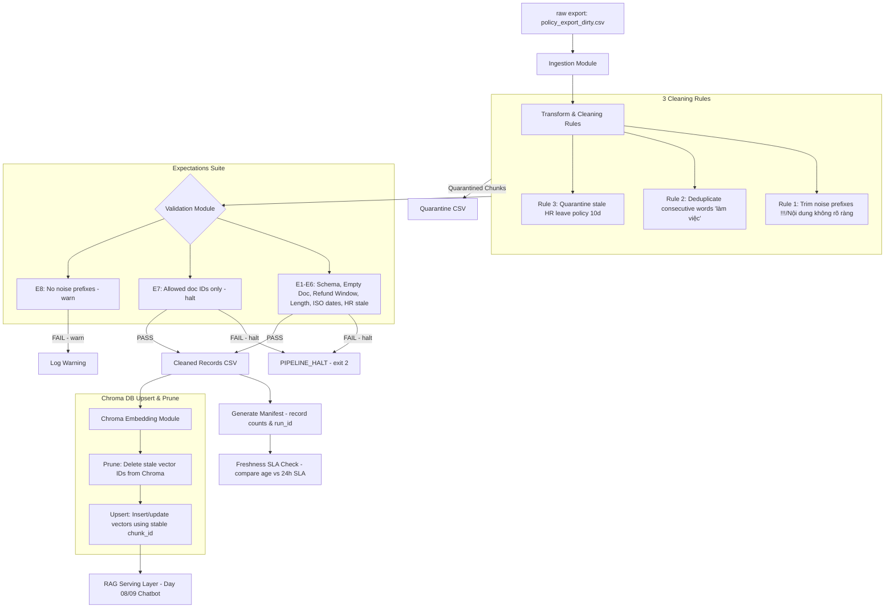

# Kiến trúc pipeline — Lab Day 10

**Nhóm:** Cá nhân (An Trần - tranh)  
**Cập nhật:** 2026-06-10

---

## 1. Sơ đồ luồng (Mermaid workflow)

---

## 2. Ranh giới trách nhiệm

| Thành phần | Input | Output | Owner nhóm |
|------------|-------|--------|--------------|
| **Ingest** | `data/raw/policy_export_dirty.csv` | Raw Data Rows (Python Dict) | An Trần (tranh) |
| **Transform** | Raw Data Rows | Cleaned Rows & Quarantine Rows (with reason) | An Trần (tranh) |
| **Quality** | Cleaned Rows | Expectations validation results (halt/warn) | An Trần (tranh) |
| **Embed** | Cleaned Rows & Chroma DB Connection | Vector Collection in Chroma DB with pruned stale records | An Trần (tranh) |
| **Monitor** | Manifest & Run Metadata | Freshness SLA report, Logs & metrics output | An Trần (tranh) |

---

## 3. Idempotency & Rerun

* **Mã hoá stable `chunk_id`**: Mỗi chunk khi chạy qua bước clean sẽ sinh ra một `chunk_id` duy nhất dựa trên hash SHA-256 của `doc_id`, `chunk_text`, và số thứ tự `seq`.
* **Cơ chế Upsert**: Khi nạp dữ liệu vào Chroma, phương thức `col.upsert()` được sử dụng thay vì `add()`. Cơ chế này đảm bảo nếu chạy lại pipeline nhiều lần với cùng một tập dữ liệu, các chunk có ID trùng nhau sẽ chỉ bị cập nhật đè (overwrite) mà không sinh ra vector trùng lặp.
* **Chiến dịch Pruning (Xoá rác)**: Trước khi lưu các vector mới, hệ thống sẽ lấy toàn bộ ID hiện có trong collection, tìm những ID cũ không còn nằm trong danh sách `cleaned_rows` của lượt chạy này và tiến hành xoá bỏ (`col.delete()`). Điều này ngăn ngừa các vector của phiên bản cũ hoặc các tài liệu đã bị quarantine ở lượt chạy mới tiếp tục tồn tại gây nhiễu kết quả truy vấn.

---

## 4. Liên hệ Day 09

* Pipeline này đóng vai trò cung cấp tri thức nền tảng (Corpus) sạch và đồng bộ cho hệ thống Multi-Agent RAG ở Day 09.
* Thay vì trỏ trực tiếp agent tới các file text thô, Agent ở Day 09 sẽ truy vấn trực tiếp vào collection `day10_kb` trong ChromaDB để đảm bảo luôn truy xuất được các chính sách mới nhất (ví dụ: hoàn tiền 7 ngày thay vì 14 ngày, nghỉ phép 12 ngày thay vì 10 ngày).

---

## 5. Rủi ro đã biết

1. **Embedding Drift**: Khi thay đổi mô hình embedding (ví dụ nâng cấp từ `all-MiniLM-L6-v2` lên mô hình lớn hơn), khoảng cách vector sẽ thay đổi hoàn toàn, yêu cầu xóa sạch collection cũ và re-embed từ đầu.
2. **Kích thước file raw quá lớn**: Nếu số lượng tài liệu thô tăng lên hàng chục nghìn dòng, việc đọc và xử lý ghi file CSV đơn luồng và quét prune ID bằng RAM sẽ gặp nghẽn cổ chai hiệu năng. Cần phân nhỏ (batching) hoặc sử dụng database thay thế CSV.
3. **Múi giờ lệch**: Exported_at không đồng nhất múi giờ có thể làm sai lệch kết quả tính toán freshness SLA.
